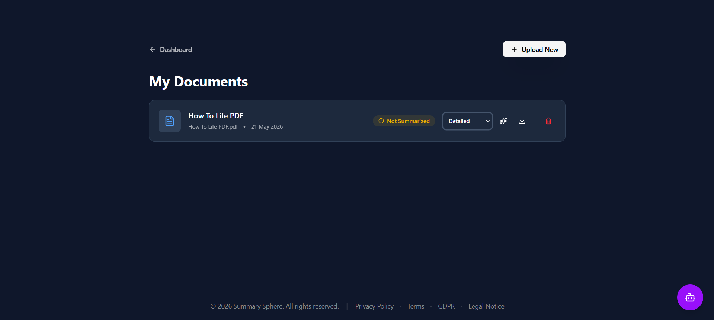
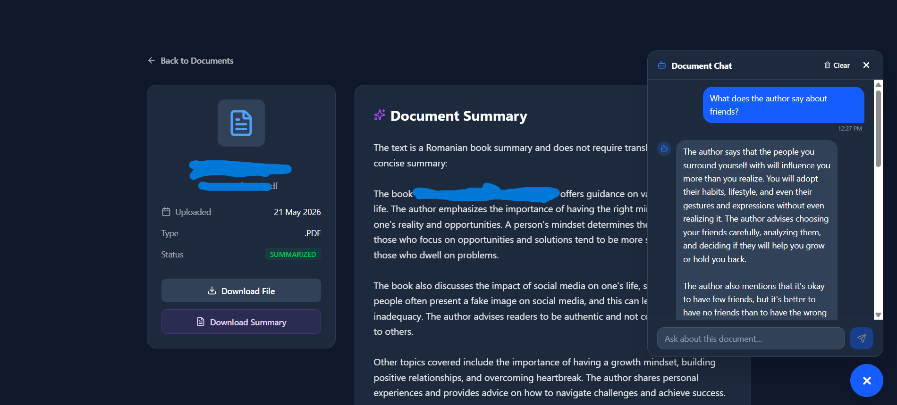

# Summary Sphere

**Summary Sphere** is the front-end for an AI-powered course summarization platform. It gives students a clean interface to upload documents, browse their archive, read generated summaries, and use document-specific or general AI chat features.

This repository contains the React-based UI that connects to the Summary Sphere backend and presents the document workflow end to end.

---

## 📸 Screenshots


*Landing page of the application.*


*Personal dashboard for uploading, managing, and summarizing documents.*


*Document upload interface.*


*Interactive chat session focusing on a specific document using RAG.*


*General AI assistant chat for study-related queries.*

---

## ✨ Key Features

* **Document Upload UI:** Upload PDF, DOCX, or TXT files through a focused and responsive interface.
* **Document Dashboard:** View uploaded documents, summary status, and available actions from one place.
* **Summary Experience:** Read generated summaries in a dedicated document details view.
* **Document Chat (RAG):** Ask questions about a specific document with contextual chat support.
* **General AI Assistant:** Use the agent chat for broader study-related questions.
* **Authentication Flows:** Includes login, registration, password recovery, and protected routes.
* **Legal Pages:** Ships with privacy, terms, GDPR, and legal notice pages.

---

## 🛠️ Tech Stack

* **Language:** TypeScript
* **Framework:** React
* **Styling:** TailwindCSS
* **Build Tool:** Vite
* **Source Control:** Git


---

## 🚀 Getting Started

### Prerequisites

* Node.js installed
* npm installed
* The Summary Sphere backend running and reachable from the frontend

### 1. Install dependencies

```bash
npm install
```

### 2. Start the frontend

```bash
npm run dev
```

The app will run on the local Vite development server.

---

## 📖 Repository Info

You're currently looking at the back-end code. Click [here](https://github.com/Rbt-Ghost/SummarySphere-Frontend) to see the back-end repository.

The repository is maintained by:

<a href="https://github.com/Rbt-Ghost">
    
</a>

<a href="https://github.com/BCBeno">
    
</a>

---

## 🤝 Acknowledgments

<p align="center">
    
    &nbsp;&nbsp;&nbsp;&nbsp;&nbsp;&nbsp;&nbsp;&nbsp;&nbsp;&nbsp;
    
</p>

This project was developed as part of the **DUAL-USV** educational program. The practical implementation and full-stack development phases were carried out under the guidance and framework of the **ASSIST Academy**.
